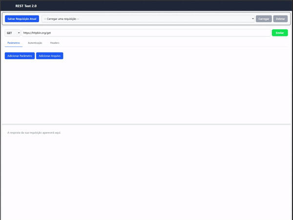

# REST Test 2.0 - Um Cliente de API Moderno



Este é um fork do maravilhoso projeto https://github.com/jeroen/resttesttest

Um cliente de API web simples, rápido e moderno para fazer requisições HTTP e inspecionar respostas. Este projeto é uma refatoração completa de uma aplicação legada, agora construída com uma stack de tecnologias de ponta, incluindo React, Vite e Tailwind CSS.

## 🚀 Sobre o Projeto

Este projeto nasceu da necessidade de modernizar uma ferramenta interna de teste de APIs. O objetivo era criar uma base de código robusta, performática e com uma excelente experiência de desenvolvimento, pronta para futuras expansões e contribuições da comunidade open source.

### ✨ Funcionalidades Principais

- **Múltiplos Métodos HTTP:** Suporte completo para GET, POST, PUT, DELETE, PATCH, e mais.
- **Painéis Redimensionáveis:** Layout inspirado em ferramentas profissionais como Postman e Insomnia, com painéis de requisição e resposta ajustáveis.
- **Interface com Abas:** Organize os detalhes da sua requisição (Parâmetros, Autenticação, Headers) e da resposta (Corpo, Headers) em abas intuitivas.
- **Autenticação Flexível:** Suporte integrado para:
  - Basic Auth
  - Bearer Token
  - API Key em Headers
- **Envio de Arquivos:** Suporte para requisições `multipart/form-data`.
- **Syntax Highlighting:** Visualização agradável e colorida para respostas em formato JSON.
- **Salvar e Carregar Requisições:** Guarde suas requisições mais usadas no `localStorage` do navegador para reutilizá-las facilmente.

### 🛠️ Construído Com

- **[React](https://reactjs.org/)** - A biblioteca para construir a interface de usuário.
- **[TypeScript](https://www.typescriptlang.org/)** - Para um código mais seguro e manutenível.
- **[Vite](https://vitejs.dev/)** - Ferramenta de build extremamente rápida.
- **[Tailwind CSS](https://tailwindcss.com/)** - Framework CSS utilitário para uma estilização moderna e customizável.
- **[Axios](https://axios-http.com/)** - Cliente HTTP para fazer as requisições.
- **[React Resizable Panels](https://react-resizable-panels.com/)** - Para os painéis de layout redimensionáveis.
- **[React Syntax Highlighter](https://github.com/react-syntax-highlighter/react-syntax-highlighter)** - Para o realce de sintaxe do JSON.

## 🏁 Começando

Para ter uma cópia do projeto rodando localmente, siga estes passos simples.

### Pré-requisitos

Você precisa ter o Node.js e o npm (ou yarn/pnpm) instalados na sua máquina.

- [Node.js](https://nodejs.org/)

### Instalação

1.  Clone o repositório:
    ```sh
    git clone [https://github.com/Qiua/resttesttest.git](https://github.com/Qiua/resttesttest.git)
    ```
2.  Navegue até a pasta do projeto:
    ```sh
    cd resttesttest
    ```
3.  Instale as dependências:
    ```sh
    npm install
    ```
4.  Inicie o servidor de desenvolvimento:
    `sh
npm run dev
`
    A aplicação estará disponível em `http://localhost:5173` (ou a porta indicada no seu terminal).

## 🗺️ Roadmap

Temos várias ideias para o futuro! Sinta-se à vontade para pegar uma delas e contribuir.

- [ ] Implementar um sistema de "Coleções" para agrupar requisições.
- [ ] Adicionar gerenciamento de "Ambientes" (ex: desenvolvimento, produção).
- [ ] Suporte para mais tipos de autenticação (ex: OAuth 2.0).
- [ ] Criar um histórico de requisições recentes.
- [ ] Melhorar a visualização de outros tipos de resposta (HTML, XML).

## 🤝 Contribuindo

Contribuições são o que fazem a comunidade open source um lugar incrível para aprender, inspirar e criar. Qualquer contribuição que você fizer será **muito bem-vinda**.

Se você tem uma sugestão para melhorar o projeto, por favor, faça um fork do repositório e crie um pull request. Você também pode simplesmente abrir uma issue com a tag "enhancement".

1.  Faça um **Fork** do projeto.
2.  Crie sua **Feature Branch** (`git checkout -b feature/FuncionalidadeIncrivel`).
3.  Faça o **Commit** de suas mudanças (`git commit -m 'Adiciona FuncionalidadeIncrivel'`).
4.  Faça o **Push** para a Branch (`git push origin feature/FuncionalidadeIncrivel`).
5.  Abra um **Pull Request**.

## 📄 Licença

Distribuído sob a Licença GPL-3.0-or-later. Veja `LICENSE.txt` para mais informações.

---
